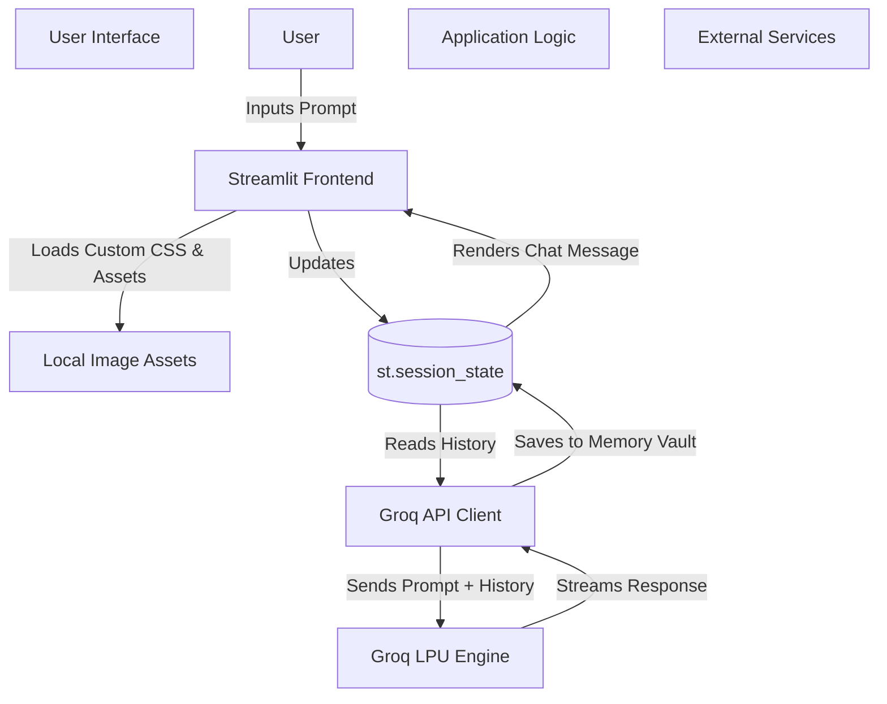

# 🌌 The Multiverse of Chatbots: Stateful Memory Vault

Welcome to the **Multiverse of Chatbots**, a high-performance, AI-powered web application that allows users to interact with multiple famous personalities (like Satoru Gojo, Luffy, Light Yagami, and more) from across the multiverse. 

This project was built as part of the **MirAI School of Technology Virtual Summer Internship**, featuring a major upgrade to a **Stateful Architecture** using Streamlit's Memory Vault, ensuring the AI characters remember the entire context of your conversation natively.

---

## ✨ Key Features
- **Stateful Memory Vault**: Fully integrated with `st.session_state` so your conversation history persists seamlessly across page reloads and character swaps.
- **Dynamic AI Avatars**: Uses custom, high-quality AI-generated local portraits (via `PIL.Image`) mapped individually to each anime character to create a deeply immersive chat interface.
- **Glassmorphism UI**: A completely custom, sleek CSS frontend with a deep-space gradient background, transparent hovering buttons, and modern typography (`Inter` font).
- **Blazing Fast AI**: Powered by Groq's LPU inference engine running the `llama-3.1-8b-instant` model for near-zero latency responses.
- **Personality Matrix**: Highly complex system prompts strictly enforce character rules, speaking styles, and response lengths.
- **Global History Export**: Download your entire multiverse conversation log as a `.txt` file or view it via an interactive popover.

---

## 🏗️ System Architecture

The application follows a simple but powerful monolithic architecture designed for speed and statefulness.



### 💻 Tech Stack
- **Frontend & Routing**: Streamlit (`st.chat_message`, `st.chat_input`)
- **Backend**: Python 3.x
- **LLM Provider**: Groq API
- **Model**: `llama-3.1-8b-instant`
- **Image Processing**: Pillow (`PIL`)
- **Styling**: HTML/CSS Injection

---

## 🚀 Installation & Setup

1. **Clone the repository:**
   ```bash
   git clone https://github.com/23p61a6680-gif/multiverse-ai.git
   cd multiverse-ai
   ```

2. **Install dependencies:**
   Make sure you have Python installed, then run:
   ```bash
   pip install -r requirements.txt
   ```

3. **Environment Setup:**
   Create a `.env` file in the root directory and add your Groq API key:
   ```env
   GROK_API_KEY=your_api_key_here
   ```

4. **Run the Application:**
   ```bash
   streamlit run app.py
   ```

## 🎥 Demo Video
*(Insert your Google Drive Video Link Here!)*
